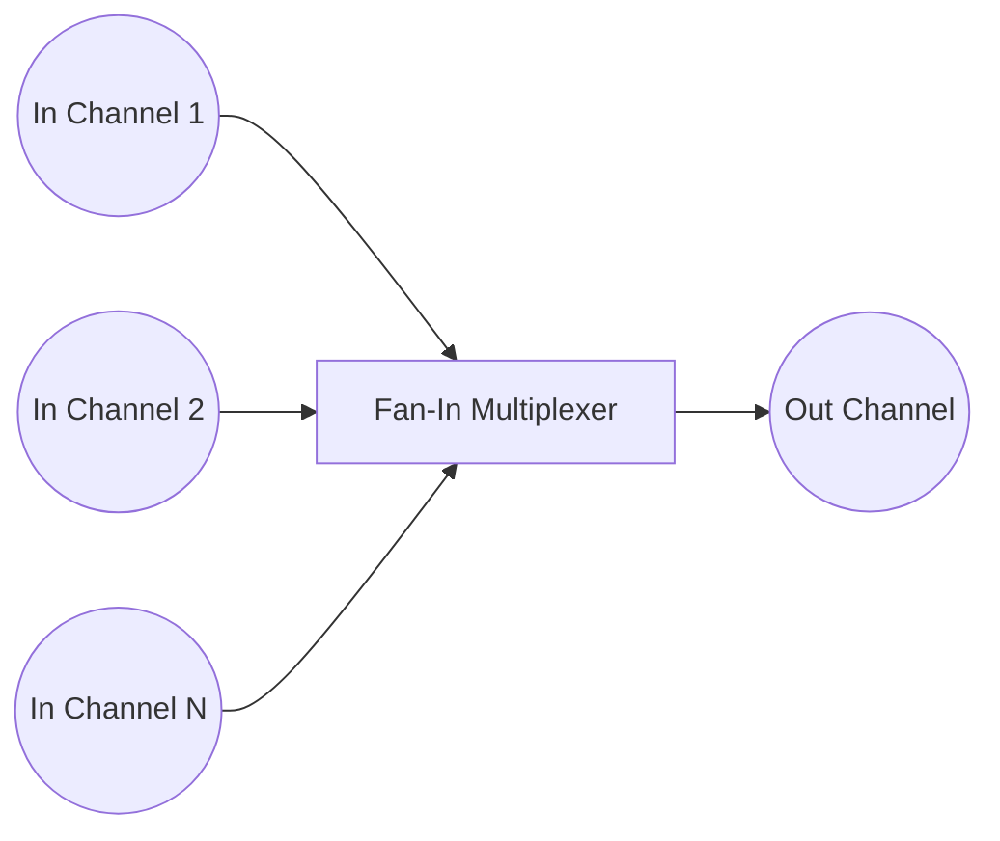

# Fan-In

**Fan-In** multiplexes **several inputs** channels into a **single output** channel.

It's useful when we're dealing with concurrent tasks that all produce data we want to collect in one place.
The **order** of output is **not guaranteed**!



## Applicability

- **Log Aggregation**. Multiple microservices or log producers are writing logs concurrently.
- **Emails sending**. Several queues form the message body, header, recipients, etc.
- **Low-latency DNS lookups across multiple resolvers**. Calling redundant services and accepting the first response that returns.

## Complementary
- Fan-In
- Worker Pool

## Example

```go
package main

import (
	"fmt"
	"sync"
	"time"
)

type payload struct {
	name  string
	value int
}

func fanIn(sources []<-chan payload) <-chan payload {
	dest := make(chan payload)
	var wg sync.WaitGroup
	wg.Add(len(sources))

	for _, ch := range sources {
		go func(c <-chan payload) {
			defer wg.Done()
			for n := range c {
				dest <- n
			}
		}(ch)
	}

	go func() {
		wg.Wait()
		close(dest)
	}()

	return dest
}

func main() {
	sources := make([]<-chan payload, 0)

	for i := 0; i < 3; i++ {
		ch := make(chan payload)
		sources = append(sources, ch)

		go func() {
			defer close(ch)
			time.Sleep(time.Second)
			ch <- payload{
				name:  fmt.Sprintf("Job #%d", i),
				value: i,
			}
		}()
	}

	dest := fanIn(sources)
	for d := range dest {
		fmt.Println(d)
	}
}
```