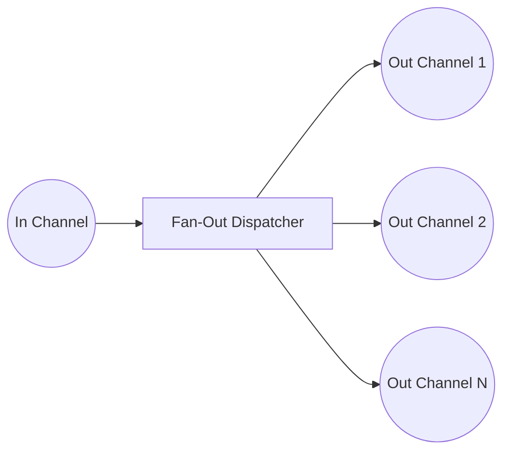

# Fan-Out

**Fan-Out** evenly distributes messages from an input channel to multiple output channels.

Using Fan-Out, you can distribute these tasks across multiple worker goroutines. This can drastically reduce the time required to process all the tasks, as the work is done in parallel.



## Applicability

 - **Parallel processing** of tasks (e.g., data transformation, I/O bound work, CPU-bound operations).
 - **API aggregation** to call several services at once. 
 - **Batch processing** when dealing with a large queue of items. 
 - **Web scraping**, where each worker fetches data from a different URL. 
 - **Image/video processing** tasks across multiple files or frames.

## Complementary
 - Fan-In
 - Worker Pool
 - Rate Limiter

## Example 1: General Implementation

```go
package main

import (
	"fmt"
	"sync"
)

func split(source <-chan int, numWorkers int) []<-chan int {
	results := make([]<-chan int, 0)

	// Fan-out: start workers
	for i := 0; i < numWorkers; i++ {
		ch := make(chan int)
		results = append(results, ch)

		go func() {
			defer close(ch)

			for val := range source {
				ch <- val
			}
		}()
	}

	return results
}

func main() {
	const numWorkers = 5
	const numJobs = 10

	source := make(chan int)
	results := split(source, numWorkers)

	go func() {
		for i := 0; i < numJobs; i++ {
			source <- i
		}

		close(source)
	}()

	var wg sync.WaitGroup
	wg.Add(len(results))

	for i, ch := range results {
		go func(i int, d <-chan int) {
			defer wg.Done()

			for val := range d {
				fmt.Printf("Worker %d got value %d\n", i, val)
			}
		}(i, ch)
	}

	wg.Wait()
}
```

## Example 2: Web Scraping with Fan-Out

```go
package main

import (
	"fmt"
	"net/http"
	"time"
)

func fetchURL(id int, url string, results chan<- string) {
	start := time.Now()
	resp, err := http.Get(url)
	if err != nil {
		results <- fmt.Sprintf("Worker %d: Error fetching %s: %v", id, url, err)
		return
	}
	defer resp.Body.Close()
	duration := time.Since(start)
	results <- fmt.Sprintf("Worker %d: Fetched %s in %v", id, url, duration)
}

func main() {
	urls := []string{
		"https://example.com",
		"https://golang.org",
		"https://httpbin.org/delay/1",
	}

	results := make(chan string, len(urls)) // Buffered so no blocking

	for i, url := range urls {
		go fetchURL(i, url, results) // Fan-out: multiple goroutines
	}

	for i := 0; i < len(urls); i++ {
		fmt.Println(<-results) // Fan-in: collecting results
	}
}
```