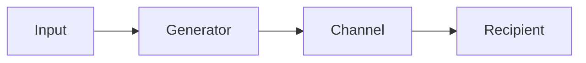

# Generator

**Generator** is used to produce a stream of values on demand.

It enables lazy evaluation and efficient resource usage by generating data only when needed, 
rather than computing an entire dataset upfront.



## Applicability

- When generating a **sequence of data** lazily (e.g. Fibonacci numbers, file lines).

- When dealing with **asynchronous data production**.

- When you need to **separate data production from consumption logic**.

- For **streaming large datasets** without loading everything into memory.

## Example
Useful when you need to read from a message queue and process messages in separate goroutines without blocking the queue reading.

```go
package main

import (
	"fmt"
	"sync"
	"time"
)

// makeGenerator starts a goroutine that generates an increasing sequence of integers.
// It writes them to a buffered channel, and stops when it receives a message on the stop channel.
// The generator will handle only reading from the queue into a buffered channel. 
// This way, writing to the channel won't block as long as there's space in the buffer for new messages (in our example, the buffer size is 1).
func makeGenerator(stop <-chan string, wg *sync.WaitGroup) <-chan int {
	ch := make(chan int, 1)
	i := 0

	go func() {
		defer wg.Done()
		for {
			select {
			case msg := <-stop:
				fmt.Printf("done, got message: %s\n", msg)
				close(ch)
				return
			default:
				time.Sleep(time.Millisecond * 250)
				ch <- i
				i++
			}
		}
	}()

	return ch
}

func main() {
	stop := make(chan string)

	wg := sync.WaitGroup{}
	wg.Add(2)

	// Start the generator
	ch := makeGenerator(stop, &wg)

	// Consumer goroutine
	go func() {
		defer wg.Done()
		for v := range ch {
			fmt.Println("value:", v)
		}
	}()

	// Let the generator run for a bit
	time.Sleep(time.Second * 1)

	// Send a stop signal with a message
	stop <- "finish job"
	close(stop)

	wg.Wait()
}
```