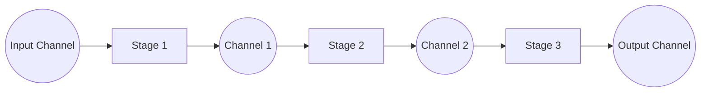

# Pipeline

**Pipeline** is a sequence of stages connected by channels.

It breaks down a task into discrete stages connected by channels, where each stage runs as a goroutine and passes data to the next.



## Applicability

- **Data Processing Pipelines**. Multiple microservices or log producers are writing logs concurrently.
- **Image or Video Processing**. A frame goes through stages like decoding → resizing → filtering → encoding.
- **Compilers or Interpreters**. Lexing → Parsing → Analyzing → Code generation.

## Code Example

```go
package main

import (
	"fmt"
	"math"
)

func main() {
	in := generateWork([]int{0, 1, 2, 3, 4, 5, 6, 7, 8})

	out := filterOdd(in) // even numbers
	out = square(out)    // square
	out = half(out)      // divide in half

	for value := range out {
		fmt.Println(value)
	}
}

func filterOdd(in <-chan int) <-chan int {
	out := make(chan int)

	go func() {
		defer close(out)

		for i := range in {
			if i%2 == 0 {
				out <- i
			}
		}
	}()

	return out
}

func square(in <-chan int) <-chan int {
	out := make(chan int)

	go func() {
		defer close(out)

		for i := range in {
			value := math.Pow(float64(i), 2)
			out <- int(value)
		}
	}()

	return out
}

func half(in <-chan int) <-chan int {
	out := make(chan int)

	go func() {
		defer close(out)

		for i := range in {
			value := i / 2
			out <- value
		}
	}()

	return out
}

func generateWork(work []int) <-chan int {
	ch := make(chan int)

	go func() {
		defer close(ch)

		for _, w := range work {
			ch <- w
		}
	}()

	return ch
}
```