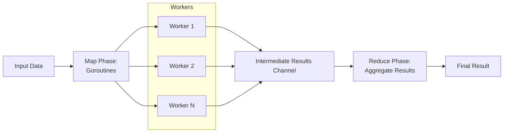

# Map-Reduce

**Map-Reduce** is a parallel computing pattern where independent tasks are **mapped** across multiple workers and their results are **reduced** (aggregated) into a final outcome.

It efficiently distributes work and then combines partial results, making it ideal for scalable, parallel data processing.



## Applicability

 - Have a large dataset that can be processed independently in parts.
 - Need to aggregate results after parallel processing (sum, merge, concatenate, etc.).
 - To maximize CPU utilization by splitting work across goroutines or workers. 
 - The "map" phase and "reduce" phase are separable (i.e., the work can be performed independently before aggregation).

## Key difference compared to the [Parallel For Loop]({{ site.baseurl }}/parallel-computing/parallel-for-loop)

 - **Parallel For Loop** = "do many independent jobs in parallel"
 - **Map-Reduce** = "do many independent jobs (Map) + combine them into a final result (Reduce)"

**Map-Reduce always has a "combination" (reduction) step. Parallel For Loop doesn't necessarily**.

## Example

```go
package main

import (
	"fmt"
	"sync"
)

// Map function: squares a number
func mapFunc(n int) int {
	return n * n
}

// Reduce function: sums a slice of numbers
func reduceFunc(results []int) int {
	sum := 0
	for _, v := range results {
		sum += v
	}
	return sum
}

func main() {
	numbers := []int{1, 2, 3, 4, 5}
	var wg sync.WaitGroup
	resultCh := make(chan int, len(numbers))

	// Map Phase: start a goroutine for each number
	for _, n := range numbers {
		wg.Add(1)
		go func(num int) {
			defer wg.Done()
			resultCh <- mapFunc(num)
		}(n)
	}

	wg.Wait()
	close(resultCh)

	// Collect results
	var intermediate []int
	for res := range resultCh {
		intermediate = append(intermediate, res)
	}

	// Reduce Phase: aggregate all results
	finalResult := reduceFunc(intermediate)

	fmt.Println("Final result:", finalResult)
}
```

### Output

```
Final result: 55
```
`(1² + 2² + 3² + 4² + 5² = 55)`