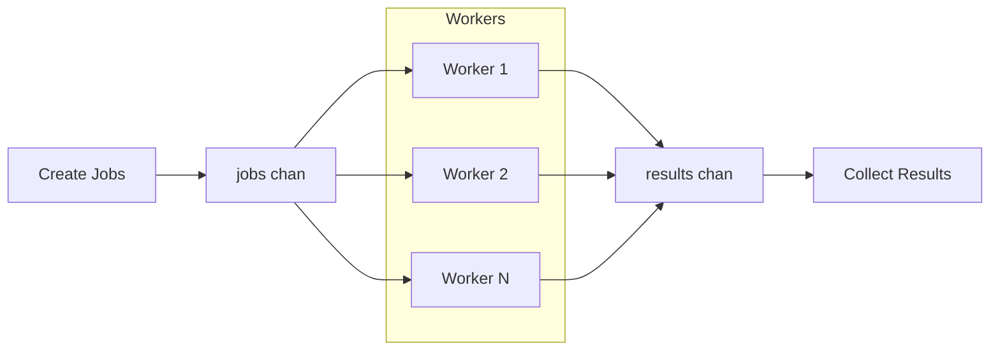

# Parallel For Loop

**Parallel For Loop** pattern is useful when you need to perform many computations over a stream of input data, and each computation is independent of the others — a scenario similar to vectorization.

You have a slice of inputs and want to process each item in parallel to speed up execution. Since each operation is isolated and has no side effects on others, you can safely run them concurrently using goroutines.



## Applicability
**Independent Computations**. 
Ideal for scenarios where each iteration of the loop is independent of the others. Each task can run concurrently without affecting the others’ results.

**CPU-bound Tasks**.
Suitable for computationally expensive operations (e.g., data processing, mathematical calculations) where each operation can be parallelized to improve performance.

**I/O-bound Operations**.
Works well for tasks that are waiting for external resources (e.g., network requests, file processing). Each task can run concurrently, improving throughput without blocking.

**Large Data Sets**.
When you have large datasets (arrays, slices, etc.), the pattern helps divide the work among multiple goroutines, speeding up the process by utilizing multiple CPU cores.

**Multiple Tasks with Similar Complexity**.
Effective when all iterations are of similar complexity and execution time, as the workload is evenly distributed among the goroutines.

**Non-blocking Parallelism**.
Ideal when you want to avoid blocking the main thread, and the results can be computed concurrently without needing to synchronize frequently during the process.

**Time-sensitive Operations**.
Useful when you need to optimize time-sensitive tasks (e.g., real-time data processing), where parallelism can significantly reduce processing time.

**Scalable Systems**.
When designing systems that need to scale efficiently across multiple cores, machines, or services, this pattern helps with the parallelization of tasks.

**Batch Processing**.
Well-suited for scenarios where tasks can be grouped into smaller batches, allowing each batch to be processed in parallel to optimize overall throughput.

## Key difference compared to the [Map-Reduce]({{ site.baseurl }}/parallel-computing/map-reduce)

- **Parallel For Loop** = "do many independent jobs in parallel"
- **Map-Reduce** = "do many independent jobs (Map) + combine them into a final result (Reduce)"

**Map-Reduce always has a "combination" (reduction) step. Parallel For Loop doesn't necessarily**.

## Example

```go
package main

import (
	"fmt"
	"sync"
	"time"
)

const dataSize = 4

func calculate(val int) int {
	time.Sleep(500 * time.Millisecond)
	return val * 2
}

func main() {
	data := make([]int, dataSize)
	for i := range data {
		data[i] = i + 10
	}
	results := make([]int, dataSize)

	fmt.Printf("Before: %v\n", data)
	start := time.Now()

	var wg sync.WaitGroup
	wg.Add(dataSize)

	for i, xi := range data {
		go func(i, xi int) {
			defer wg.Done()
			results[i] = calculate(xi)
		}(i, xi)
	}

	wg.Wait()

	fmt.Printf(" After: %v\n", results)
	fmt.Printf(" Elapsed: %s\n", time.Since(start))
}
```