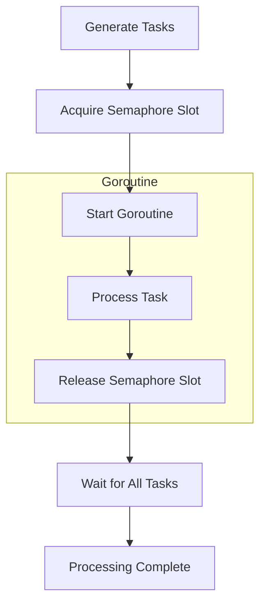

# Queuing

The **Queuing** pattern allows you to accept up to N messages for processing simultaneously without waiting for them to be processed.

A buffered channel is commonly used as a **semaphore** to throttle the number of active goroutines, providing backpressure and preventing resource exhaustion.

This pattern separates the **submission of work** from its **execution**, helping manage load and ensuring the system remains responsive under high demand.




## Applicability

- **Throttling Concurrency**.
When you need to limit the number of concurrent goroutines (e.g., for controlling resource usage or preventing overloading external systems).

- **Job Queuing**.
For managing tasks that need to be processed in parallel, such as background jobs or worker pools, with a fixed number of workers.

- **Rate Limiting**.
When you need to apply rate limits to the number of concurrent operations (e.g., API calls, database queries).

- **Preventing Resource Exhaustion**.
To ensure that the system does not spawn too many goroutines and exhaust available resources like memory or CPU.

- **Decoupling Producers and Consumers**.
When you want to decouple the generation of work (producers) from its processing (consumers), allowing for better load balancing and control.

- **Load Balancing**.
When tasks are processed in parallel, and you want to manage the load effectively across workers to ensure no one worker is overwhelmed.

## Code Example

```go
package main

import (
	"fmt"
	"sync"
	"time"
)

func process(payload int, queue chan struct{}, wg *sync.WaitGroup) {
	queue <- struct{}{}

	go func() {
		defer wg.Done()

		fmt.Printf("Start processing of %d\n", payload)
		time.Sleep(time.Millisecond * 500)
		fmt.Printf("Completed processing of %d\n", payload)
		fmt.Printf("Queue length: %d\n\n", len(queue))

		<-queue
	}()
}

func main() {
	const numWorkers = 3
	const numMessages = 1000

	var wg sync.WaitGroup

	fmt.Println("Queue of length numWorkers:", numWorkers)

	// Buffered channel as semaphore
	queue := make(chan struct{}, numWorkers)

	wg.Add(numMessages)

	for w := 1; w <= numMessages; w++ {
		process(w, queue, &wg)
	}

	wg.Wait()

	close(queue)
	fmt.Println("Processing completed")
}
```