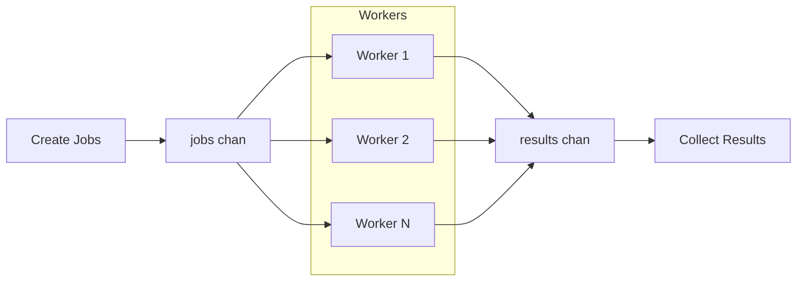

# Worker Pool

**Worker Pool** is a concurrency pattern used to **limit the number of goroutines** that process tasks concurrently. 
It involves a **fixed number of workers** (goroutines) that listen on a jobs channel for incoming tasks and send results to a results channel. 

This pattern helps control resource usage and improves performance when handling a large number of tasks.



## Applicability
- **Rate-limiting Goroutines**.
When you need to control the number of concurrently running goroutines to avoid overwhelming system resources (e.g., memory, CPU, database connections).

- **Batch Processing of Tasks**.
Ideal for processing a queue of tasks like image processing, file parsing, or API calls, where each task is independent but resource-intensive.

- **Parallel I/O or Network Operations**.
Useful when performing concurrent network calls (e.g., calling external APIs, fetching data from multiple URLs), while limiting the number of simultaneous operations.

- **Controlled Concurrency in Server Applications**.
Prevents resource exhaustion in high-throughput systems like web servers or microservices by capping the number of tasks handled at once.

- **CPU-bound or Time-consuming Workloads**.
For long-running tasks like data transformations or simulations, the pattern helps keep the CPU busy without spawning excessive goroutines.

- **Worker Queues in Background Jobs**.
Perfect for job processing systems where tasks are submitted to a queue (e.g., background email sending, message processing).

## Alternatives
- **Semaphore**. Use a channel as a counting semaphore to limit concurrency
- **Error group** with limit.

## Example

```go
package main

import (
	"fmt"
	"time"
)

func worker(id int, jobs <-chan int, results chan<- int) {
	for j := range jobs {
		fmt.Println("worker", id, "started  job", j)
		time.Sleep(time.Second)
		fmt.Println("worker", id, "finished job", j)
		results <- j * 2
	}
}

func main() {
	const numJobs = 5
	const numWorkers = 3

	jobs := make(chan int, numJobs)
	results := make(chan int, numJobs)

	for w := 1; w <= numWorkers; w++ {
		go worker(w, jobs, results)
	}

	for j := 1; j <= numJobs; j++ {
		jobs <- j
	}
	close(jobs)

	for a := 1; a <= numJobs; a++ {
		<-results
	}
}
```